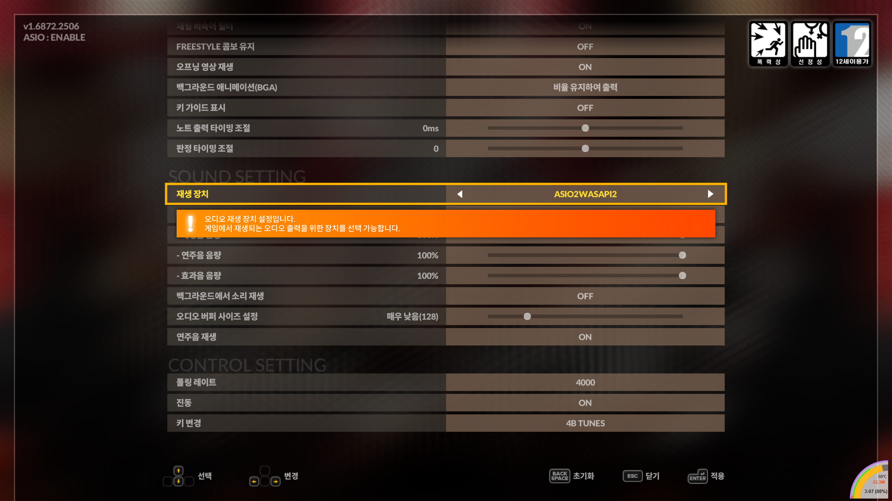
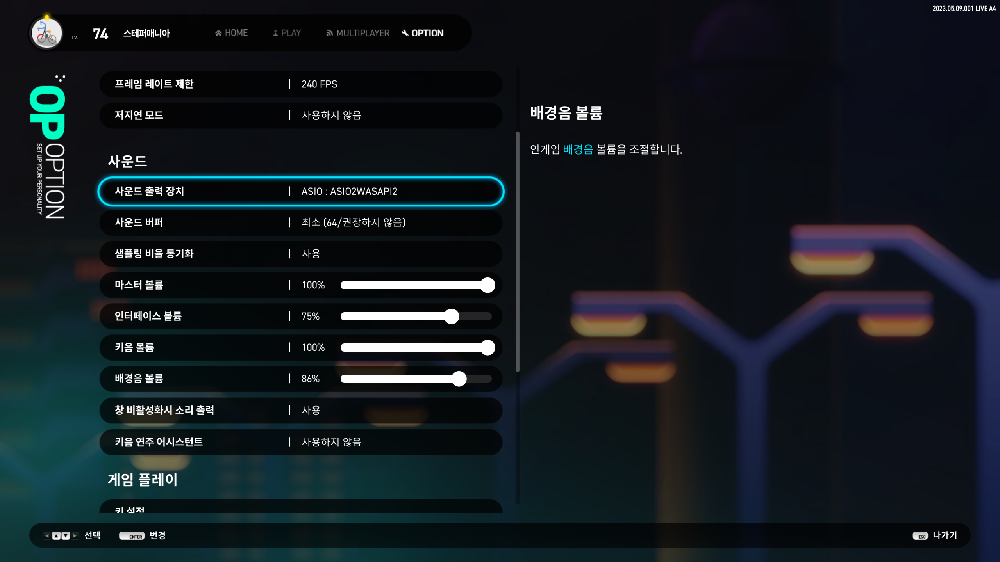
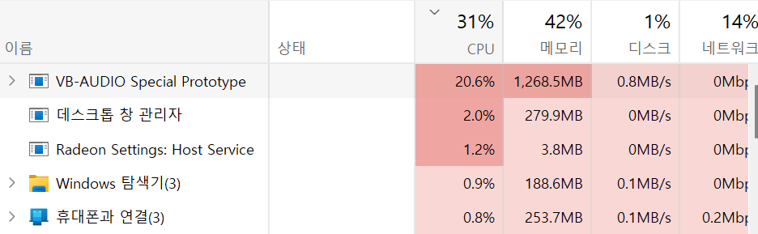

# trgkASIO

trgkASIO는 가상 ASIO를 쉽게 만들어주는 프로그램입니다. 가상ASIO를 사용하면서 [VB-Audio Virtual Audio Cable](https://vb-audio.com/Cable/) 같은
프로그램을 활용해 소리를 OBS/반디캠 등으로 녹음할 수 있습니다.

## 설치방법

[Releases](https://github.com/phu54321/TrgkASIO/releases/) 폴더에서 가장 최근 릴리즈를 다운받아서 `Install.exe` 를 관리자 권한으로 실행하면 설치가
끝납니다.

추가적으로 ASIO를 녹음하려면 [VB-Audio 사이트](https://vb-audio.com/Cable/)로 가서 Virtual Audio Cable을 설치하시면 됩니다.

## 사용방법 (공통)

소리는 2곳으로 나갑니다.

- 기본 오디오 장치: 지금 아무 유튜브나 틀었을 때 이어폰으로 나오면 그 이어폰으로, 스피커로 나오면 그 스피커로
- VB-Audio Virtual Audio Cable: OBS나 반디캠 녹화용으로 쓰세요.

자세한 설정은 밑에 `설정` 파트 참고하세요. 일반인은 딱히 건드릴 필요 없을겁니다.

## 사용방법 (DJMAX)



위와 같이 재생 장치를 `trgkASIO` 로 설정하면 됩니다. `오디오 버퍼 사이즈 설정` 은 원하시는 대로 하세요.

## 사용방법 (EZ2ON)



위와 같이 사운드 출력 장치를 `ASIO: trgkASIO` 로 해두시면 됩니다. `사운드 버퍼` 는 원하시는대로 낮추세요.

## 전문가 설정

- 로그는 `C:\Users\[사용자 이름]\trgkASIO.log` 가 이미 있는 경우에, 해당 경로에 적힙니다.
- 프로그램 설정은 `C:\Users\[사용자 이름]\trgkASIO.json` 으로 할 수 있습니다.

설정 파일은 이렇게 쓰면 됩니다.

```json
{
  "logLevel": "trace",
  "deviceId": [
    "(default device)",
    "MyAudioDevice",
    "{0.0.0.00000000}.{00000000-0000-0000-0000-000000000000}"
  ],
  "sampleRate": 48000,
  "channelCount": 2,
  "bufferSize": 1024,
  "clapGain": 0.5,
  "throttle": true,
  "durationOverride": {
    "{0.0.0.00000000}.{00000000-0000-0000-0000-000000000000}": 50000
  }
}
```

- `bufferSize`: 일단 지금은 아무 의미 없습니다.
- `logLevel`: `"trace" | "debug" | "info" | "warn" | "error"`. Trace를 하면 좀 많이 나옵니다. 기본값은 `"debug"`.
- `deviceId`: 출력 디바이스 이름 배열. `(default)` 는 기본 출력 디바이스를 뜻합니다.
- `clapGain`: 클랩사운드 음량 조절. 0.0 ~ 1.0 범위입니다.
- `throttle`: 전반적으로 CPU를 좀 덜 씁니다. 약간의 사운드 시간 발생할 수 있습니다.
  `false`로 설정할 경우 게임 CPU 사용량 / 게임 렉이 체감 될 정도로 생길 수 있습니다
  CPU가 아주아주 충분할 때 `false`로 사용하세요.
  
- `durationOverride`: 특정 디바이스에서 출력이 깨질 경우, 해당 디바이스의 출력 버퍼 사이즈를 강제로 조절할 수 있습니다.
  로그파일의 `minimum duration {} default duration {}` 파트를 참고하세요. 특정 리얼텍 제품군에서 이 값을 `100000` (10ms)
  단위로 설정해야하는 경우가 있었습니다.

## 버그 제보

- `logLevel`을 `trace` 로 설정해두고
- `TrgkASIO.log` 파일을 뽑으신 뒤에
- 해당 파일 첨부해서 issues 에 열어주세요

I'm okay with English, so feel free to leave issues even if you don't know Korean.
:) Nevertheless don't expect ETA: this is a hobby project.

----

## 코드 라이선스 (License)

> NOTE: The license below only applies to the source code of TrgkASIO itself. the
> ASIO trademark and ASIO SDK are subject to specific license terms; see
> "Steinberg ASIO Licensing Agreement" in the ASIO SDK.
>
> ASIO is a trademark and software of Steinberg Media Technologies GmbH.


다음 오픈소스 프로젝트 코드를 참조했습니다.

- ASIO2WASAPI: https://github.com/levmin/ASIO2WASAPI
- FlexASIO: https://github.com/dechamps/FlexASIO/
- PortAudio: http://www.portaudio.com/

메인 라이선스는 [GPL 2.0](./LICENSE.txt) 를 따릅니다.
